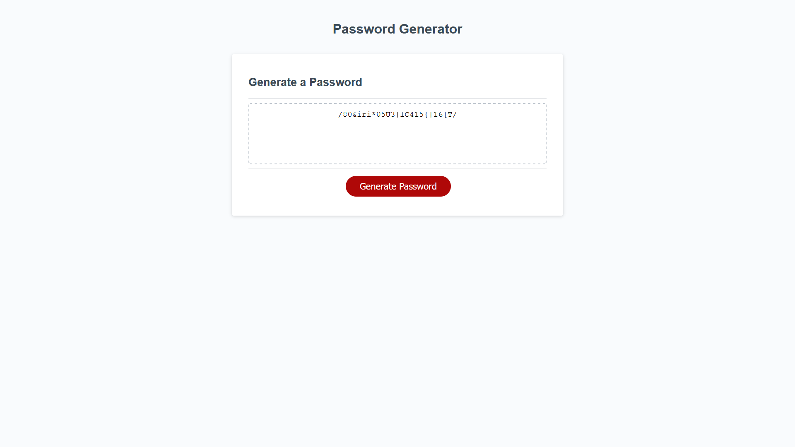

## Website Link

https://drew990.github.io/banagas-password-generator/

# About The Project



In Module 3 challenge, we created a password generator that will ask the users a series of questions about what they will like in their password. We are going to make this happen by using what we learn previously of HTML, CSS, and adding Javascript into the picture to create the generator.

# Behind the Scenes Description

Below, you'll find sections of which that talk about setting the foundation in order to make it work, the functions and methods behind them

## Setting the Foundation

Before anything can happen, global variables must be set up in order for this generator to work. First we must create characters such as Lowercase, Uppercase, special characters, and number characters. Below is the code.

```javascript
var charactersUPPER = "ABCDEFGHIJKLMNOPQRSTUVWXYZ";
var charactersLOWER = "abcdefghijklmnopqrstuvwxyz";
var charactersNUMERIC = "0123456789";
var charactersSPECIAL = "~`!@#$%^&*()_+-={}[]|:;'<>,.?/";
```

After we'll create variables that will allow us to store true or false if the user wants a certain character when ask

```javascript
var lowercaseCharacters,
  uppercaseCharacters,
  numericCharacters,
  specialCharacters;
```

The last two global variables we will create is if a character type was even picked at all and a variable for us to store the generated password in.

```javascript
let passwordGen = "";
var charactersTypePick = false;
```

Now we're ready to get started 👍

## Asking Questions

To know what the user wants in their password, we need to ask them a series of questions. First, we'll ask them the length of it between 8 and 128. We want a strong password but still realistic where they can remember or have it saved in a system that doesn't cap it. How are we gonna ask it and get the number we need?

First ask the question and we'll filter it out after. Then make sure the length is within the range. Below is the code.

```javascript
//Ask user for password length
var passwordLengthInput = window.prompt(
  "How long do you want your password to be? Pick a number between 8 and 128."
);
//Filter non-numbers from it
var passwordLength = passwordLengthInput.replace(/\D/g, "");

  //Checks if the numbers are within range
  if (passwordLength < 8 || passwordLength > 128) {
    //Ask user to re-enter in the length until the condition meets the criteria
    while (passwordLength < 8 || passwordLength > 128) {
      passwordLengthInput = window.prompt(
        "Re-enter a number between 8 and 128."
      );

      //Filter non-numbers from it
      passwordLength = passwordLengthInput.replace(/\D/g, "");
    }
```

## Picking Characters

We need to figure out which characters will be included so we must ask the user using `window.confirm` then saving them into a variable as true or false. Below is the code

```javascript
while (charactersTypePick === false) {
  //Ask User for they want to include lowercase
  lowercaseCharacters = window.confirm(
    "Would you like lowercase characters? Click OK for YES. Cancel for NO"
  );

  //Ask User for they want to include uppercase
  uppercaseCharacters = window.confirm(
    "Would you like uppercase characters? Click OK for YES. Cancel for NO"
  );

  //Ask User for they want to include numeric
  numericCharacters = window.confirm(
    "Would you like numeric characters? Click OK for YES. Cancel for NO"
  );

  //Ask User for they want to include special characters
  specialCharacters = window.confirm(
    "Would you like special characters? Click OK for YES. Cancel for NO"
  );

  if (
    lowercaseCharacters === false &&
    uppercaseCharacters === false &&
    numericCharacters === false &&
    specialCharacters === false
  ) {
    window.alert(
      "No characters have been selected for the password generator. Please accept one to get a password"
    );
  } else {
  }
}
```

The reason why its in a while loop is that if none are pick, it'll constantly loop until one is pick, preventing an error in the code

## Password Generator

Now comes the cool part of this code. We finally have the questions answer to make a password. First, we need to create local variables.

- CaseNum is going to pick a number then follow into the function and grab a character from it
- charactersLength is going to grab the length of characters of Uppercase, lowercase, numbers, or special characters

Whats going to happen next is it's going to enter in a for loop, then a while loop and get the characters that the user wants. It'll keep looping until it has meet the users length.

```javascript
else {
      let caseNum, charactersLength;
      let passwordEnter = false;

      //Will create password now
      for (var i = 0; i < passwordLength; i++) {
        //Enters while loop to build password
        while (passwordEnter === false) {
          //Picks which characters to do
          caseNum = Math.floor(Math.random() * 4);

          //Lower case build
          if (caseNum === 0 && lowercaseCharacters === true) {
            charactersLength = charactersLOWER.length;
            passwordGen += charactersLOWER.charAt(
              Math.floor(Math.random() * charactersLength)
            );
            passwordEnter = true;
          }
          //Upper case build
          else if (caseNum === 1 && uppercaseCharacters === true) {
            charactersLength = charactersUPPER.length;
            passwordGen += charactersUPPER.charAt(
              Math.floor(Math.random() * charactersLength)
            );
            passwordEnter = true;
          }
          //Number case build
          else if (caseNum === 2 && numericCharacters === true) {
            charactersLength = charactersNUMERIC.length;
            passwordGen += charactersNUMERIC.charAt(
              Math.floor(Math.random() * charactersLength)
            );
            passwordEnter = true;
          }
          //Special case build
          else if (caseNum === 3 && specialCharacters === true) {
            charactersLength = charactersSPECIAL.length;
            console.log(charactersLength);
            passwordGen += charactersSPECIAL.charAt(
              Math.floor(Math.random() * charactersLength)
            );
            passwordEnter = true;
          }
        }
        passwordEnter = false;
      }
      charactersTypePick = true;
    }
```

# Author

Andrew Banagas
